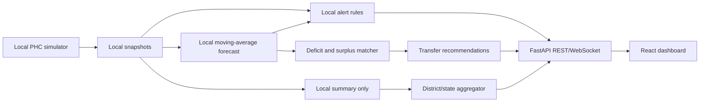

# SwasthyaNet MVP Architecture

## Purpose

SwasthyaNet is a synthetic, demo-oriented federated health-resource resilience platform for a simulated India Primary Health Centre (PHC) network. The MVP prioritizes a reliable end-to-end judge demo over production completeness.

All displayed PHC, medicine, staffing, bed, distance, and forecast data will be clearly labeled as synthetic. The architecture leaves an integration boundary for future DHIS2 or state-health feeds without requiring real patient data in the hackathon demo.

## Proposed repository structure

```text
swasthyanet/
├── backend/
│   ├── app/
│   │   ├── main.py                    # FastAPI application and WebSocket endpoint
│   │   ├── config.py                  # Environment-driven settings
│   │   ├── api/
│   │   │   ├── routes_dashboard.py    # Summary, PHC, chart, and map endpoints
│   │   │   ├── routes_alerts.py       # Alert feed and acknowledgement endpoints
│   │   │   └── routes_recommendations.py
│   │   ├── models/
│   │   │   ├── domain.py              # Pydantic response/request models
│   │   │   └── enums.py
│   │   ├── services/
│   │   │   ├── simulator.py           # Deterministic synthetic daily updates
│   │   │   ├── forecasting.py         # Moving-average forecast and stockout ETA
│   │   │   ├── alerts.py               # Rule- and forecast-based alert engine
│   │   │   ├── redistribution.py      # Surplus/deficit transfer recommender
│   │   │   └── federation.py           # Local summaries and weighted aggregation
│   │   ├── data/
│   │   │   └── seed.py                # Plausible PHC, district, and SKU fixtures
│   │   └── storage/
│   │       ├── repository.py          # SQLite-backed persistence boundary
│   │       └── schema.py              # SQLAlchemy tables
│   ├── tests/
│   ├── requirements.txt
│   └── Dockerfile
├── frontend/
│   ├── src/
│   │   ├── components/
│   │   │   ├── Header.tsx
│   │   │   ├── KpiCard.tsx
│   │   │   ├── PhcStatusTable.tsx
│   │   │   ├── AlertFeed.tsx
│   │   │   ├── ForecastChart.tsx
│   │   │   ├── RedistributionPanel.tsx
│   │   │   ├── PhcMap.tsx
│   │   │   └── FederationFlow.tsx
│   │   ├── pages/Dashboard.tsx
│   │   ├── lib/api.ts
│   │   ├── types.ts
│   │   ├── App.tsx
│   │   └── main.tsx
│   ├── package.json
│   ├── vite.config.ts
│   ├── tailwind.config.js
│   ├── Dockerfile
│   └── nginx.conf
├── docker-compose.yml
├── README.md
└── ARCHITECTURE.md
```

## Core data model

| Entity | Key fields | Purpose |
|---|---|---|
| `District` | `id`, `name`, `state`, `center_lat`, `center_lon` | Groups PHCs and supplies route context. |
| `PHC` | `id`, `name`, `district_id`, `lat`, `lon`, `total_beds`, `occupied_beds`, `staff_attendance_pct`, `status` | Represents one simulated local health node. |
| `Medicine` | `id`, `sku`, `name`, `unit`, `category` | Defines a medicine tracked across PHCs. |
| `InventorySnapshot` | `phc_id`, `medicine_id`, `snapshot_date`, `quantity`, `reorder_threshold`, `daily_consumption` | Stores local inventory history used by forecasting. |
| `BedSnapshot` | `phc_id`, `snapshot_date`, `total_beds`, `occupied_beds` | Stores occupancy history and capacity alerts. |
| `StaffSnapshot` | `phc_id`, `snapshot_date`, `attendance_pct` | Stores simulated attendance history. |
| `Forecast` | `phc_id`, `medicine_id`, `generated_at`, `predicted_daily_use`, `predicted_quantity`, `days_until_stockout`, `confidence` | Exposes the explainable moving-average forecast. |
| `Alert` | `id`, `phc_id`, `type`, `severity`, `title`, `message`, `created_at`, `is_active` | Drives the live alert feed and map colors. |
| `TransferRecommendation` | `id`, `source_phc_id`, `destination_phc_id`, `medicine_id`, `quantity`, `distance_km`, `reason`, `priority` | Recommends redistribution from surplus to shortage. |
| `FederatedUpdate` | `phc_id`, `district_id`, `period`, `sample_count`, `local_metrics`, `shared_update`, `aggregated_at` | Makes the privacy-preserving local-node-to-aggregator concept visible. |

## Processing flow



The simulator will update a small number of PHCs every few seconds while retaining a seeded multi-day history. Raw inventory and attendance snapshots are treated as local-node data. The federation service shares only aggregate metrics and weighted forecast summaries, so the UI can demonstrate the architectural privacy boundary without pretending to implement production-grade secure federated learning.

## Explainable MVP algorithms

The forecast uses a weighted moving average over recent daily consumption. For each PHC and medicine, predicted daily use is calculated from the most recent observations, with higher weight on recent days. Days until stockout is estimated as current quantity divided by predicted daily use, bounded to a safe display range when consumption is zero. A low-confidence marker is shown when history is insufficient.

A stock alert is generated when the estimated stockout date falls within the configured warning window or when quantity is at or below the reorder threshold. A bed alert is generated when occupancy exceeds the critical percentage. Staff attendance contributes to PHC health status but does not block the primary alert path.

Redistribution matches destination shortages with source surpluses by medicine, preferring the same district, then neighboring districts. Suggested quantity is limited by the source's safe surplus and the destination's estimated near-term requirement. Distance is calculated from synthetic coordinates using the haversine formula and is explicitly presented as an approximate planning distance.

## Initial demo defaults

The seed will include 6 PHCs across 3 districts, 12 medicine SKUs, 30 days of history, and a deliberately observable shortage/occupancy scenario. The live simulation interval will default to 8 seconds and will expose a manual `simulate tick` action so the judge can trigger an alert deterministically if needed.

## Reliability decisions

SQLite is the default local database to keep `docker-compose up` fast and self-contained; the repository layer will keep SQLAlchemy boundaries portable to PostgreSQL. The backend will return the last valid snapshot if a simulation tick fails. Forecasting will use a dependency-light implementation rather than requiring Prophet. The map will degrade to a coordinate-based card/list if external map tiles are unavailable.

## Judge-facing story

The dashboard opens on the national summary, then drills into a red PHC, shows a medicine stockout curve, reveals the alert cause, recommends a transfer from a nearby surplus PHC, and finishes on the federated-flow panel showing that only aggregates move upward. A compact synthetic-data banner remains visible so the demo cannot be mistaken for a clinical production system.

## Data contract sketch

```python
class Forecast:
    phc_id: str
    medicine_id: str
    predicted_daily_use: float
    days_until_stockout: float | None
    predicted_quantity: list[float]
    confidence: float

class Alert:
    phc_id: str
    severity: Literal["critical", "warning", "info"]
    type: Literal["stockout", "beds", "staff"]
    title: str
    message: str

class TransferRecommendation:
    source_phc_id: str
    destination_phc_id: str
    medicine_id: str
    quantity: int
    distance_km: float
    priority: Literal["high", "medium", "low"]
```

This document is the implementation baseline and can be revised after the repository is provided or after the scaffold reveals existing project conventions.

> **Important:** This MVP is a simulation for a hackathon demonstration. It is not a clinical decision-support system and must not be used for real medical, inventory, staffing, or emergency operations.

## References

No external factual sources are required for this architecture baseline because the implementation uses synthetic data and the user-provided requirements as its specification.
``` 

## Next implementation step

Once the repository URL or `owner/repository` is provided, the project can be aligned with its existing files and the backend simulator, forecasting module, alert engine, and recommender can be implemented first.
