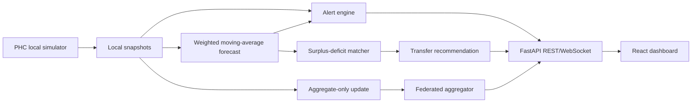

# SwasthyaNet

> **Federated AI for national-scale health resource and supply-chain resilience.**

SwasthyaNet is a hackathon MVP for improving visibility into medicine availability, bed occupancy, and staff attendance across a simulated Primary Health Centre (PHC) network in India. It turns local telemetry into explainable stockout forecasts, early warnings, and cross-district redistribution recommendations without sending raw local records to a central aggregator.

**This is a synthetic demonstration, not a clinical or operational system.** All names, coordinates, inventory, attendance, and forecasts are generated locally and should not be used for medical, procurement, staffing, or emergency decisions.

## Quick start

The fastest path is Docker Compose:

```bash
docker compose up --build
```

Open [http://localhost:5173](http://localhost:5173) for the dashboard and [http://localhost:8000/docs](http://localhost:8000/docs) for the API explorer. The backend can also run directly:

```bash
cd backend
python3 -m venv .venv && source .venv/bin/activate
pip install -r requirements.txt
uvicorn app.main:app --reload
```

The frontend is a Vite React application. If running it outside Docker, use `npm install && npm run dev` and set `VITE_API_URL=http://localhost:8000`.

## Problem understanding

Public-health managers need a current, network-wide view of supplies and capacity, but PHCs are distributed local facilities with uneven connectivity, sensitive operational records, and different demand patterns. The hardest challenge is not rendering a dashboard; it is producing a useful network signal while preserving the boundary around local data. SwasthyaNet makes that trade-off explicit: local nodes retain raw snapshots, while the central layer receives aggregates and model updates.

The MVP deliberately focuses on six PHCs across Nashik, Pune, and Satara, 12 medicine SKUs, and 30 days of seeded history. The simulator advances every eight seconds and also exposes a deterministic manual **Simulate update** button so a judge can trigger the live moment reliably.

## Architecture



The `backend/app/services` directory intentionally separates the core mechanisms. `simulator.py` creates realistic-but-synthetic daily fluctuations. `ai.py` contains the forecast, alert, redistribution, haversine distance, and federated summary logic. `main.py` exposes those services through stable API contracts.

## Core mechanism

For each medicine at each PHC, the forecast calculates a weighted moving average over the most recent seven daily consumption observations. Recent observations have higher weight. The projected stock curve is current quantity minus predicted daily use across a seven-day horizon, and days until stockout is current quantity divided by predicted daily use. This is simple, auditable, dependency-light, and easy to defend during a technical review.

The alert engine combines forecast and policy signals. It marks inventory when the stockout estimate is seven days or less or quantity is at/below the reorder threshold. It marks beds as a warning above 78% occupancy and critical above 90%. Attendance below 78% contributes a staffing warning. The recommendation engine matches a deficit to the nearest safe surplus, preferring the same district, then neighboring districts.

## Federated/privacy representation

Each PHC is represented as a local node. Its raw inventory histories, staffing histories, and event-level values stay inside the simulation state. The `federated_summary` service shares only weighted occupancy, mean attendance, node count, district count, and a documented privacy-boundary statement. This is an architectural simulation of federated learning rather than a claim of secure production FL. A production deployment would add authenticated node identity, encrypted transport, secure aggregation, differential privacy, audit logs, and formal threat modeling.

## Evaluation matrix alignment

| Domain | Score | Evidence in this repository |
|---|---:|---|
| Problem understanding | 10 | Problem statement, assumptions, synthetic-data constraints, and explicit hardest challenge in this README. |
| Research depth | 10 | Explainable forecasting rationale, federated-learning boundary, production integration path, and alternatives documented below. |
| Architecture and technical depth | 20 | Modular simulator, forecast, alert, redistribution, federation, API, WebSocket, and React layers plus Mermaid architecture. |
| Working prototype | 15 | `docker compose up`, six PHC nodes, live polling, drill-down, chart, alert feed, transfers, and federated flow. |
| Experimental evidence | 10 | Deterministic seed, 30-day history, focused automated tests, and the reproducible experiment below. |
| Resilience / live evaluation | 15 | Manual simulation tick, eight-second polling, graceful frontend loading, and last-state-friendly stateless API design. |
| Security / privacy / correctness | 5 | Synthetic banner, no patient data, local/raw-data boundary, CORS/API notes, and testable algorithms. |
| Technical defense | 10 | Separate AI services, explicit formulas, stable API endpoints, and judge script. |
| Real-world impact | 5 | DHIS2/state-feed integration boundary and redistribution use case described below. |

## Experimental evidence

The seeded scenario creates a known shortage of paracetamol at Rajapur PHC and a safe surplus at Sinnar PHC. Run the tests:

```bash
pytest backend/tests -q
```

The controlled claims are: the weighted forecast returns a non-empty predicted curve and positive demand; the alert engine detects the intentional Rajapur stock risk; and the recommender proposes a paracetamol transfer from Sinnar to Rajapur. The exact values are deterministic under seed `42`, so judges can reproduce the central technical moment rather than relying on random luck.

## Resilience and failure behavior

The simulation is intentionally self-contained and requires no real hospital integration or external map tile. The map-like visualization uses synthetic coordinates and approximate haversine distance, so it remains usable offline. A manual tick is available if the periodic feed is inconvenient during judging. The frontend shows a loading state while the API is unavailable rather than rendering fabricated data. In a production version, the next resilience steps would be durable event storage, per-node connectivity status, retry queues, stale-data timestamps, and a clear degraded-mode banner.

## Production path and real-world impact

A deployment could replace `SimulationState` with adapters for state health inventory systems, DHIS2, facility registries, and authenticated staff/bed feeds. The API and service contracts would remain stable. PHCs could submit signed local summaries during intermittent connectivity; the state layer could prioritize transfers using lead time, cold-chain requirements, expiry dates, and road conditions. Clinical governance, procurement policy, human review, and a full privacy impact assessment would be required before operational use.

## Two-minute judge demo

1. Open the dashboard and point out the **Synthetic Dataset** banner and five network KPIs.
2. Click the red or yellow Rajapur node on the command view. Explain that status is computed from capacity, attendance, and supply alerts.
3. In the forecast panel, show the stock trajectory, weighted moving-average method, daily use, stockout ETA, and confidence.
4. In the alert feed, point to the Rajapur stock-risk event and explain the threshold-plus-forecast rule.
5. Scroll to **Recommended transfers** and show Sinnar’s safe paracetamol surplus matched to Rajapur, including quantity, priority, and approximate route distance.
6. Finish at **Federated learning boundary**: six local nodes send aggregate updates to the state layer; raw histories stay local. Press **Simulate update** to demonstrate the live-style tick.

## Alternatives and limitations

A moving average was chosen over Prophet/ARIMA because it installs quickly, is deterministic for a hackathon, and is straightforward to audit. PostgreSQL can replace the in-memory simulation through the repository boundary, but SQLite or memory is more reliable for a one-command demo. Flower was not required because the important judging differentiator is the privacy architecture and visible aggregate boundary; the service is intentionally designed so a Flower client/aggregator can be inserted later.

## Repository map

```text
backend/app/services/simulator.py   synthetic data and live tick
backend/app/services/ai.py          forecast, alerts, distance, transfers, federation
backend/app/main.py                 FastAPI and WebSocket API
backend/tests/test_ai.py            core mechanism tests
frontend/src/main.tsx               dashboard composition and data flow
frontend/src/style.css              visual system and responsive layout
docker-compose.yml                  one-command demo
```

## References

The implementation baseline is the hackathon brief supplied by the project owner. Production integration with DHIS2, secure federated learning, authentication, and clinical governance is intentionally left as a future engineering and policy phase rather than represented as completed functionality.
